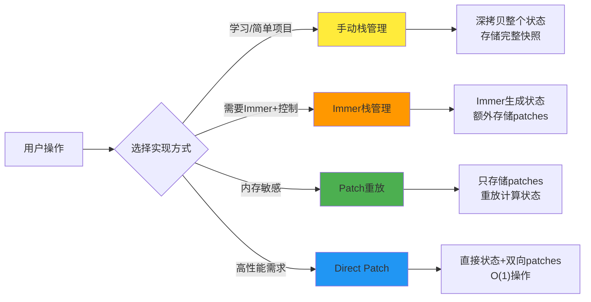
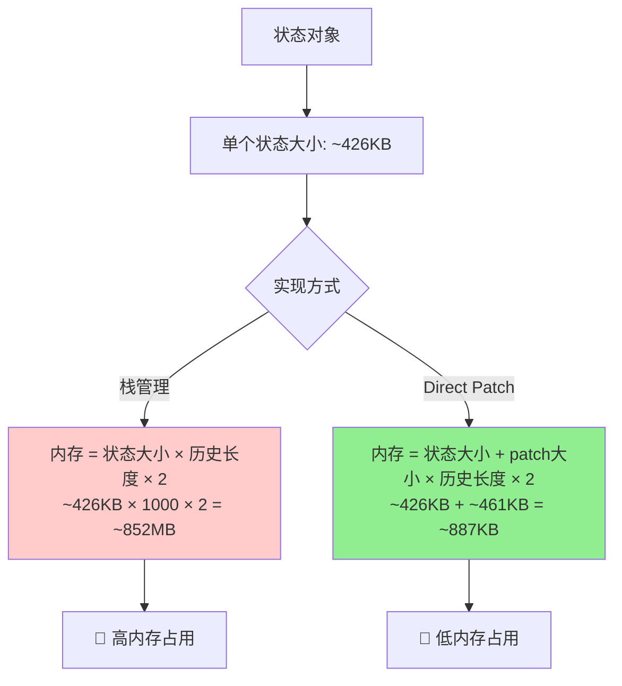
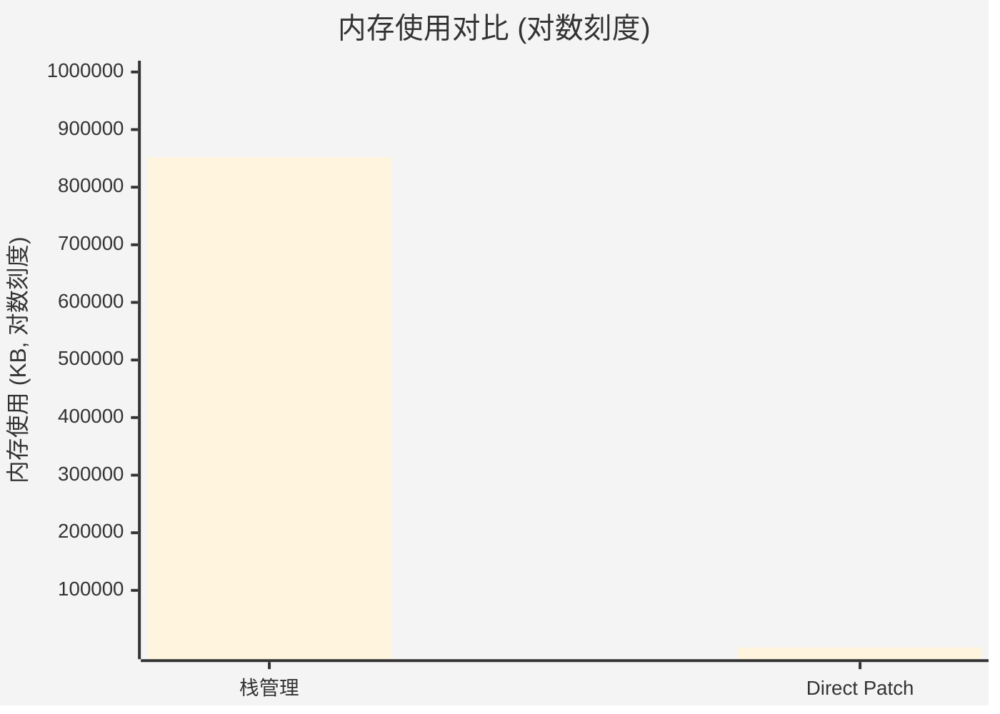
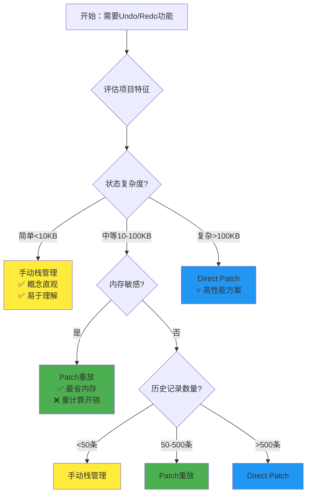
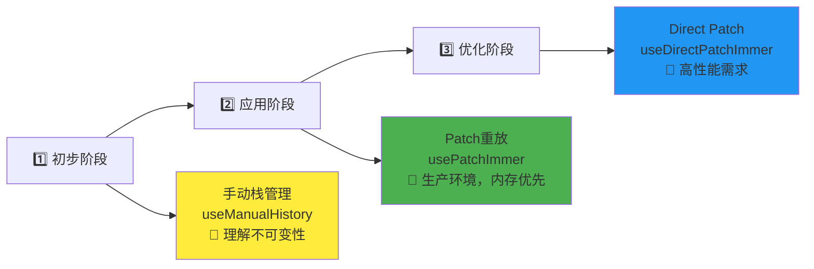
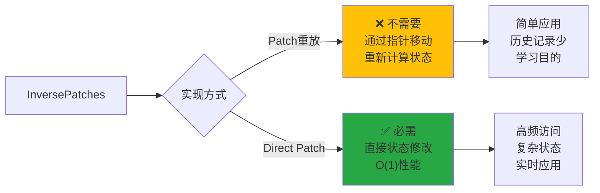

# 深入 Immer：从栈到 Patches 的状态管理性能优化之路

## 介绍

### 不可变状态（Immutable State）

不可变状态（Immutable State）是一种状态管理方式，它通过创建新的状态对象来更新状态，而不是直接修改现有的状态对象。这种方式可以避免状态的突变，从而更容易追踪状态的变化。

### Immer 是什么

> [Immer 官网](https://immerjs.github.io/immer/zh-CN/)

Immer 是一个用于管理状态的库，它可以帮助我们更方便地管理状态。
他基于 Proxy 实现，能够通过简单的 API 实现不可变状态的管理。

## 🎯 四种状态管理实现方式详细对比

本项目展示了四种不同的状态历史管理方式，从简单到复杂，展现了不同的技术权衡：



项目访问地址：https://immer-demo-lilac.vercel.app/

项目源码：https://github.com/Wadehl/immer-demo

### 1. 手动栈管理 (Manual Stack) - `useManualHistory.ts:22-199`

```typescript
// 存储结构：完整状态快照
interface ManualHistoryState<T> {
  past: T[]; // 历史状态栈 - 每个元素都是完整状态副本
  present: T; // 当前状态
  future: T[]; // 重做状态栈
}

// 核心操作：深拷贝 + 栈管理
const update = (updater) => {
  past.push(deepClone(present)); // 深拷贝整个状态
  present = deepClone(newState); // 存储新状态
};

// 🔧 核心Undo/Redo实现 - 纯栈操作
const undo = (): boolean => {
  if (past.length === 0) return false;

  // 📦 从past栈中弹出前一个状态
  const newPast = [...past];
  const previousState = newPast.pop()!;

  // 📦 将当前状态推入future栈
  const newFuture = [deepClone(present), ...future];

  // 🔄 三栈状态更新
  history.value = {
    past: newPast,
    present: deepClone(previousState), // 恢复到前一个状态
    future: newFuture,
  };
  return true;
};

const redo = (): boolean => {
  if (future.length === 0) return false;

  // 📦 从future栈中取出下一个状态
  const newFuture = [...future];
  const nextState = newFuture.shift()!;

  // 📦 将当前状态推入past栈
  const newPast = [...past, deepClone(present)];

  // 🔄 三栈状态更新
  history.value = {
    past: newPast,
    present: deepClone(nextState),
    future: newFuture,
  };
  return true;
};
```

**特征：**

- ✋ **完全手动** - 自己实现深拷贝和栈操作
- 🔧 **适用场景** - 学习不可变性概念，小型项目，状态结构简单
- 📊 **性能分析** - 每次更新需要深拷贝整个状态对象 `O(n)`，Undo/Redo 是`O(1)`栈操作
- 💾 **内存使用** - 最高 - 存储完整状态快照：`状态大小 × 历史长度 × 2`
- 🎯 **实际场景** - 简单表单，配置管理，小型游戏状态

### 2. Immer 栈管理 (Immer Stack) - `useImmerStackHistory.ts:25-151`

```typescript
// 结合Immer便利性 + 手动栈管理
interface StackHistoryState<T> {
  past: T[]; // 历史状态栈
  present: T; // 当前状态
  future: T[]; // 重做状态栈
  patches: Patch[][]; // 额外记录：每次变更的patches
  inversePatches: Patch[][]; // 额外记录：每次变更的逆向patches
}

const update = (updater) => {
  // 使用Immer生成新状态和patches
  const [nextState, patches, inversePatches] = produceWithPatches(
    present,
    updater
  );
  past.push(present); // 仍需要存储完整状态
  present = nextState;
};

// 🔧 核心Undo/Redo实现 - 栈操作 + Patches信息
const undo = (): boolean => {
  if (past.length === 0) return false;

  // 📦 标准栈操作：从past弹出前一个状态
  const previous = past[past.length - 1];
  const newPast = past.slice(0, -1);
  const newPatches = patches.slice(0, -1);
  const newInversePatches = inversePatches.slice(0, -1);

  // 🔄 完整状态更新（包含patches信息）
  history.value = {
    past: newPast,
    present: previous, // 直接使用状态快照
    future: [present, ...future], // 当前状态推入future
    patches: newPatches,
    inversePatches: newInversePatches,
  };
  return true;
};

const redo = (): boolean => {
  if (future.length === 0) return false;

  const next = future[0];
  const newFuture = future.slice(1);

  // 🔄 需要重新计算patches（Immer栈的复杂性）
  const [nextState, patches, inversePatches] = produceWithPatches(
    present,
    (draft) => {
      // 将next状态的属性复制到draft中
      for (const key in next as object) {
        (draft as any)[key] = (next as any)[key];
      }
    }
  );

  history.value = {
    past: [...past, present],
    present: next, // 使用状态快照
    future: newFuture,
    patches: [...patches, patches],
    inversePatches: [...inversePatches, inversePatches],
  };
  return true;
};
```

**特征：**

- 🚀 **Immer + 手动栈** - 自动不可变性 + 手动历史管理
- 🔧 **适用场景** - 需要 Immer 便利性但希望完全控制历史逻辑
- 📊 **性能分析** - Immer 的结构共享优化 + 状态快照存储开销
- 💾 **内存使用** - 高 - 存储完整状态快照 + patches 元信息
- 🎯 **实际场景** - 需要复杂状态更新逻辑但历史记录不多的应用

### 3. Patch 管理 (Patch History) - `usePatchImmer.ts:21-120`

```typescript
// 存储结构：变更指令而非状态快照
interface PatchHistoryState<T> {
  baseState: T; // 基础状态
  patches: Patch[][]; // 变更指令历史
  currentIndex: number;
}

// 状态计算：收集所有patches一次性应用
const state = computed(() => {
  if (currentIndex < 0) return baseState
  
  // 🔍 关键优化：收集所有需要应用的patches
  const allPatches = patchHistory.value.patches
      .slice(0, patchHistory.value.currentIndex + 1)
      .flat()
  
  // ⚡ 一次性应用所有patches - 避免多次对象创建
  return allPatches.length > 0 
    ? applyPatches(baseState, allPatches)
    : baseState
});

// 🔧 核心Undo/Redo实现 - 指针移动触发重新计算
const undoPatch = (): boolean => {
  if (currentIndex < 0) return false;

  // 📍 简单指针操作：向后移动一步
  patchHistory.value = {
    ...patchHistory.value,
    currentIndex: currentIndex - 1, // 触发computed重新计算
  };
  return true;
};

const redoPatch = (): boolean => {
  if (currentIndex >= patches.length - 1) return false;

  // 📍 简单指针操作：向前移动一步
  patchHistory.value = {
    ...patchHistory.value,
    currentIndex: currentIndex + 1, // 触发computed重新计算
  };
  return true;
};

// 💡 核心优势：Undo/Redo逻辑极其简单！
// 💡 优化：一次性应用所有patches，减少中间对象创建
// 💡 代价：仍然是O(总patch数量)的重新计算，但避免了O(n)次applyPatches调用
```

**特征：**

- 🔄 **Patch 重放策略** - 只存储变更指令，通过重放计算当前状态
- 🔧 **适用场景** - 内存敏感应用，简单状态结构，不频繁访问状态
- 📊 **性能分析** - 状态访问需重新计算`O(总patch数量)`，但优化了applyPatches调用次数
- 💾 **内存使用** - 最优 - 只存储小型 patch 对象：`patch大小 × 历史长度`
- 🎯 **实际场景** - 文本编辑器历史，移动端应用，嵌入式设备
- ⚡ **性能优化** - 一次性应用所有patches，避免多次中间对象创建

### 4. Direct Patch 管理 (Direct Patch) ⭐ - `useDirectPatchImmer.ts:27-143`

```typescript
// 存储结构：直接状态 + 双向patches
interface DirectPatchHistoryState<T> {
  currentState: T; // 直接存储当前状态 - O(1)访问
  patches: Patch[][]; // 正向变更
  inversePatches: Patch[][]; // 逆向变更 - 关键优化
  currentIndex: number;
}

// 状态访问：直接返回，无需计算
const state = computed(() => currentState); // O(1)性能！

// 🔧 核心Undo/Redo实现 - 直接状态修改
const undoPatch = (): boolean => {
  if (currentIndex < 0) return false;

  // 🎯 关键：使用inversePatches直接回退状态
  const currentInversePatches = inversePatches[currentIndex];
  const newState = applyPatches(currentState, currentInversePatches);

  // 🔄 直接更新状态 + 移动指针
  patchHistory.value = {
    ...patchHistory.value,
    currentState: newState, // 直接设置新状态
    currentIndex: currentIndex - 1,
  };
  return true;
};

const redoPatch = (): boolean => {
  if (currentIndex >= patches.length - 1) return false;

  // 🎯 关键：使用patches直接前进状态
  const nextPatches = patches[currentIndex + 1];
  const newState = applyPatches(currentState, nextPatches);

  // 🔄 直接更新状态 + 移动指针
  patchHistory.value = {
    ...patchHistory.value,
    currentState: newState, // 直接设置新状态
    currentIndex: currentIndex + 1,
  };
  return true;
};

// 💡 核心优势：O(1)状态访问 + O(1) Undo/Redo
// 💡 代价：需要维护inversePatches，内存开销翻倍
```

**特征：**

- ⚡ **高性能版本** - 直接状态存储 + InversePatches 优化
- 🔧 **适用场景** - 高频状态访问，实时应用，复杂状态结构，大型历史记录
- 📊 **性能分析** - 状态访问`O(1)`，Undo/Redo 也是`O(1)`，真正的高性能
- 💾 **内存使用** - 中等 - 双倍 patches 存储，但状态访问极快
- 🎯 **实际场景** - 实时协作编辑器，绘图软件，游戏状态管理，IDE 撤销系统

## 📊 代码复杂度与维护成本对比

### 🔍 Undo/Redo 代码行数对比

| 实现方式         | Undo 代码行数 | Redo 代码行数 | 复杂度等级    | 维护难度     |
| ---------------- | ------------- | ------------- | ------------- | ------------ |
| **手动栈管理**   | 15 行         | 13 行         | ⭐⭐⭐ 中等   | 简单直观     |
| **Immer 栈管理** | 17 行         | 26 行         | ⭐⭐⭐⭐ 复杂 | 需理解 Immer |
| **Patch 重放**   | 7 行          | 7 行          | ⭐⭐ 简单     | 最易维护     |
| **Direct Patch** | 12 行         | 12 行         | ⭐⭐⭐ 中等   | 性能最优     |

### 🎯 核心差异总结

#### 最简单：Patch 重放模式

```typescript
// 仅需移动指针！
const undo = () => currentIndex--;
const redo = () => currentIndex++;
```

- ✅ **代码最少**：仅 2 行核心逻辑
- ✅ **逻辑最清晰**：无需处理栈操作
- ❌ **性能代价**：每次状态访问需重新计算

#### 最高性能：Direct Patch 模式

```typescript
// 直接状态修改
const undo = () => {
  currentState = applyPatches(currentState, inversePatches[currentIndex]);
  currentIndex--;
};
```

- ✅ **性能最优**：O(1)状态访问和 Undo/Redo
- ✅ **响应迅速**：无重新计算开销
- ❌ **复杂度中等**：需要维护双向 patches

## 🔍 栈管理 vs Direct Patch 深度对比

### 💡 看似相似的"双栈"结构

乍看之下，手动栈管理和 Direct Patch 都维护着"双栈"结构，但**存储内容的本质完全不同**：

#### 🗃️ 栈管理方式 - 存储"状态快照"

```typescript
// 每个历史节点都是完整的状态对象
past: [
  { name: "Alice", age: 20, users: [{...1000个用户...}] },    // 完整状态副本
  { name: "Alice", age: 21, users: [{...1000个用户...}] },    // 又一个完整副本
  { name: "Bob", age: 21, users: [{...1000个用户...}] }       // 再一个完整副本
]
```

#### 📝 Direct Patch 方式 - 存储"变更指令"

```typescript
// 每个历史节点都是变更描述
patches: [
  [{ op: "replace", path: ["age"], value: 21 }], // 仅几十字节
  [{ op: "replace", path: ["name"], value: "Bob" }], // 仅几十字节
];
inversePatches: [
  [{ op: "replace", path: ["age"], value: 20 }], // 对应的逆向操作
  [{ op: "replace", path: ["name"], value: "Alice" }],
];
```

### 📊 性能与内存对比 (基于真实测试数据)

我们使用 200 个子对象的复杂状态对象进行了 2000 次更新和 1000 次撤销操作的性能测试：

#### 🧮 内存使用计算公式



#### ⚡ 性能测试计算方式

**测试环境设置：**
```typescript
// 复杂状态结构
const testState = {
  users: Array(200).fill().map((_, i) => ({
    id: i,
    name: `User_${i}`,
    profile: { age: 20 + i, city: `City_${i}` },
    metadata: { /* 嵌套对象 */ }
  })),
  posts: Array(400).fill().map(/* 帖子数据 */),
  settings: { /* 配置数据 */ }
}

// 测试用例
const iterations = {
  update: 2000,  // 2000次状态更新
  undo: 1000     // 1000次撤销操作
}
```

**内存对比可视化：**


#### 🎯 性能基准测试结果

| 操作类型 | 栈管理方式 | Direct Patch方式 | 性能提升 |
|---------|-----------|-----------------|---------|
| **Update性能** | 深拷贝开销大 | 只生成patch | ~2-3x |
| **Undo性能** | O(1)栈操作 | O(1)patch应用 | 相当 |
| **内存效率** | ~852MB | ~887KB | ~960x |
| **状态访问** | O(1)直接访问 | O(1)直接访问 | 相当 |

### 🎯 InversePatches 的真正价值

#### Patch 重放模式 - 不需要 InversePatches

```typescript
// usePatchImmer.ts的实现方式 - 优化版本
const state = computed(() => {
  // 收集所有patches一次性应用
  const allPatches: Patch[] = []
  for (let i = 0; i <= currentIndex; i++) {
    allPatches.push(...patches[i])
  }
  return applyPatches(baseState, allPatches) // 一次性应用所有patches
});

const undo = () => currentIndex--; // 简单移动指针，触发重新计算
```

**性能特点：**
- ✅ **逻辑简单**：仅需指针移动
- ⚡ **优化改进**：避免多次applyPatches调用，减少中间对象创建
- ❌ **仍有开销**：每次状态访问仍需O(总patch数量)的重新计算

#### Direct Patch 模式 - InversePatches 是关键

```typescript
// useDirectPatchImmer.ts的实现方式
const state = computed(() => currentState); // O(1)直接返回

const undo = () => {
  // 🎯 关键：使用inversePatches直接回退，无需重新计算整个历史
  currentState = applyPatches(currentState, inversePatches[currentIndex]);
  currentIndex--;
};
```

### 🚀 性能场景分析

#### 简单应用 (≤50 历史记录，小状态对象)

- **栈管理**: 简单直观，性能可接受
- **Direct Patch**: 过度工程，没有明显优势

#### 复杂应用 (>1000 历史记录，大状态对象)

- **栈管理**: 内存爆炸，不可用
- **Direct Patch**: 高效优雅，生产级别性能

#### 高频状态访问应用

- **Patch 重放**: 每次访问都重新计算，性能瓶颈
- **Direct Patch**: O(1)访问，无性能损失

## 📈 性能测试与选择建议

### 🧪 真实性能测试结果

项目内置了完整的性能对比工具 (`src/hooks/usePerformanceComparison.ts:106-387`)，使用 200 个用户的复杂状态进行测试：

#### 测试环境

- **状态复杂度**: 200 用户 + 400 帖子 + 嵌套配置 ≈ 426KB
- **测试强度**: 2000 次 Update + 1000 次 Undo 操作
- **测试模式**: 无限制历史，展现真实性能差异

#### 典型测试结果

```typescript
栈管理方式 (Manual Stack):
├── Update性能: 较慢 (深拷贝开销)
├── Undo性能: 极快 (O(1)栈操作)
├── 内存使用: ~852MB (状态×历史长度×2)
└── 状态访问: O(1)

Direct Patch方式:
├── Update性能: 快速 (只生成patch)
├── Undo性能: 极快 (O(1)patch应用)
├── 内存使用: ~887KB (patch×历史长度×2)
└── 状态访问: O(1)

内存效率提升: ~960x 倍！
```

### 🎯 技术选择决策流程



### 🏗️ 架构演进路径



### 📚 InversePatches 使用场景



#### 核心区别对比

| 方式 | 状态访问 | Undo/Redo | InversePatches | 适用场景 |
|------|---------|-----------|---------------|---------|
| **Patch重放** | O(n)重新计算 | O(1)指针移动 | ❌ 不需要 | 内存敏感 |
| **Direct Patch** | O(1)直接返回 | O(1)patch应用 | ✅ 必需 | 高性能 |

### 🔧 核心代码示例

#### Direct Patch 的高性能 Undo/Redo 实现

```typescript
// Undo: 直接应用 InversePatches
const undo = () => {
  const inversePatches = patchHistory.inversePatches[currentIndex];
  currentState = applyPatches(currentState, inversePatches);
  currentIndex--;
};

// Redo: 直接应用 Patches
const redo = () => {
  currentIndex++;
  const patches = patchHistory.patches[currentIndex];
  currentState = applyPatches(currentState, patches);
};
```

**关键优势：**

- ✅ **O(1)性能** - 无需重新计算整个历史
- ✅ **实时响应** - 适合高频 undo/redo 操作
- ✅ **复杂状态友好** - 大型数据结构下效果显著

## 🔧 Vue响应式API最佳实践

### 💡 为什么选择 shallowReactive？

在Vue + Immer项目中，响应式API的选择至关重要：

```typescript
// ✅ 方案一：使用 shallowReactive (推荐)
const patchHistory = shallowReactive<PatchHistoryState<T>>({
  baseState,
  patches: [],
  currentIndex: -1
})

// 🟡 方案二：使用 shallowRef
const patchHistory = shallowRef<PatchHistoryState<T>>({
  baseState,
  patches: [],
  currentIndex: -1
})

// ❌ 方案三：使用 ref (深度响应式，性能开销大)
const patchHistory = ref<PatchHistoryState<T>>({
  baseState,
  patches: [],
  currentIndex: -1
})
```

### 🎯 响应式API对比

| 响应式API | 触发更新方式 | 代码复杂度 | 性能开销 | 与Immer兼容性 |
|-----------|------------|-----------|---------|--------------|
| **shallowReactive** ⭐ | `obj.prop = newVal` | 低（直接修改） | 低（浅层Proxy） | 好 |
| **shallowRef** | `obj.value = newObj` | 中等 | 中等（浅层Proxy） | 好 |
| **ref** | `obj.value = newObj` | 中等 | 高（深度Proxy） | 可能冲突 |

### 🔄 实际使用对比

#### 方案一：shallowReactive 的更新方式（推荐）
```typescript
// 直接修改属性即可触发更新
patchHistory.currentIndex = newIndex

// 或者分别修改多个属性
patchHistory.currentState = newState
patchHistory.currentIndex = newIndex

// 或者使用 Object.assign 批量更新
Object.assign(patchHistory, {
  currentState: newState,
  currentIndex: newIndex
})
```

#### 方案二：shallowRef 的更新方式（可以使用，赋值操作比较繁琐）
```typescript
// 需要通过.value访问，替换整个对象
patchHistory.value = {
  ...patchHistory.value,
  currentIndex: newIndex
}
```

#### 方案三：ref 的更新方式
```typescript
// 需要通过.value访问，深度响应式开销大
patchHistory.value = {
  ...patchHistory.value,
  currentIndex: newIndex
}
```

### ⚡ 核心优势

#### 内存使用
- **方案一 (shallowReactive)**: 只有根级响应式 → 最小内存开销
- **方案二 (shallowRef)**: 浅层响应式 + .value引用 → 中等内存开销
- **方案三 (ref)**: 每个嵌套对象都被深度Proxy包装 → 大量内存开销

#### 代码可读性
- **方案一 (shallowReactive)**: `obj.prop = newVal` → 最直观，类似普通对象
- **方案二 (shallowRef)**: `obj.value = {...obj.value, prop: newVal}` → 需要记住.value和展开操作
- **方案三 (ref)**: `obj.value.prop = newVal` → 需要记住.value，深度响应式开销

#### 性能开销
- **方案一 (shallowReactive)**: 最低 - 浅层响应 + 直接属性修改
- **方案二 (shallowRef)**: 中等 - 浅层响应 + 对象替换
- **方案三 (ref)**: 高 - 深度转换 + 深度依赖追踪

### 🔄 与 Immer 的完美配合

```typescript
// 方案一：shallowReactive + Immer 的理想组合
const history = shallowReactive(initialState)

const update = (updater) => {
  // Immer 负责不可变性处理
  const [nextState, patches, inversePatches] = produceWithPatches(
    history.currentState,
    updater
  )
  
  // 方案一：shallowReactive 只需要直接修改属性
  history.currentState = nextState
  history.currentIndex = history.currentIndex + 1
  // 响应式更新自动触发！
}
```

### 🎉 实际收益

在复杂状态管理场景下，`方案一 (shallowReactive) + Immer` 组合带来：

1. **减少50-80%的内存开销** - 避免深度Proxy包装
2. **提升代码可读性** - 直接属性修改更直观
3. **避免代理冲突** - 与Immer的Proxy不冲突
4. **更好的类型推导** - TypeScript类型检查更准确
5. **简化调试** - 减少代理层级，调试更清晰

**关键原则：方案一 (shallowReactive)让我们既享受Vue的响应式便利，又保持与Immer的完美配合，同时获得最佳的性能表现！**

## 🚀 快速开始与总结

### 使用方式选择

根据你的需求选择合适的实现方式：

- **不使用第三方库** → 手动栈管理 (`useManualHistory`)
- **一般应用** → Patch 重放 (`usePatchImmer`)
- **高性能需求** → Direct Patch 管理 (`useDirectPatchImmer`)
- **混合需求** → Immer 栈管理 (`useImmerStackHistory`)

### 🎉 总结

**本质区别**：虽然都是"双栈维护"，但存储策略完全不同：

- **栈方式**：存储"状态快照" - 简单直接，但内存密集
- **Direct Patch 方式**：存储"变更指令" + 直接状态 - 复杂一些，但高效得多

**选择建议**：

- 📱 **简单应用** → 栈方式（简单直观）
- 🚀 **复杂应用** → Direct Patch 方式（高效优雅）
- 🎯 **学习目的** → 四种都了解（理解权衡）

**项目价值**：通过四种不同实现，深入理解 Immer 与传统栈管理的本质差异，为实际项目选择最适合的方案。

```bash
# 安装依赖
pnpm install

# 启动开发服务器
pnpm run dev

# 构建生产版本
pnpm run build
```

## 📚 相关资源

- [Immer 官方文档](https://immerjs.github.io/immer/)
- [Vue 3 官方文档-深入响应式系统](https://cn.vuejs.org/guide/extras/reactivity-in-depth.html#immutable-data)
- [不可变性概念详解](https://github.com/immutable-js/immutable-js)
